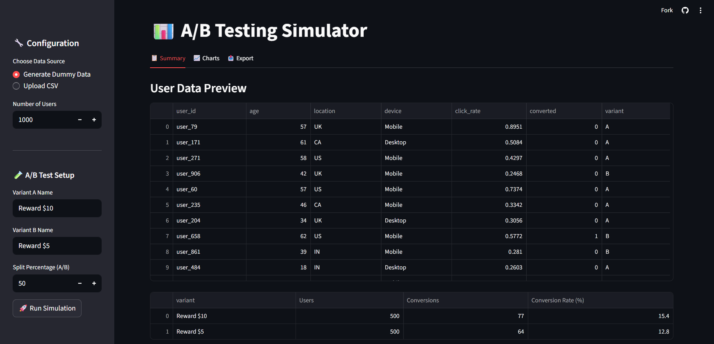
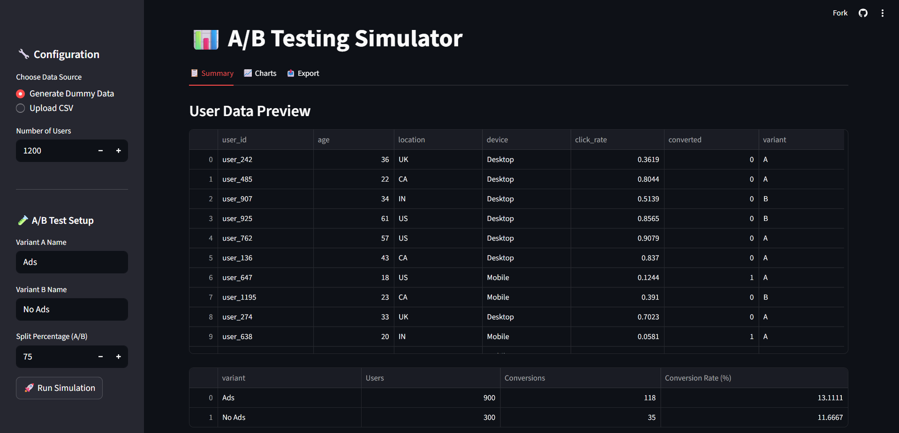

# 🧪 A/B Testing Simulator

I built this interactive web app using **Python, Streamlit, Numpy, Pandas, and Plotly**, focusing on making real-time simulation intuitive and accessible. No complex setup required.

---

## 🔧 What it Does

* **Allows users to test different rewards, content, or design variants**
* **Simulates real-world A/B experiments and provides instant insights**
* **Choose data source:** generate dummy data or upload your own CSV
* **Configure number of users, test split (A/B), and variant names**

---

## 🎯 Who It's For

**Marketers, Product Teams, and Analysts** looking to:

* Test new referral or reward strategies
* Simulate real-world A/B outcomes
* Share clear insights with stakeholders instantly

---

## 📊 Example Scenario 1

* **# of Users:** 1000
* **Split:** 50% A / 50% B
* **Variant A:** Reward \$10
* **Variant B:** Reward \$5

### 🔍 Insights

* **Variant A outperforms Variant B** in terms of conversion rate: **15.4% vs. 12.8%**
* Although both variants had an equal sample size of 1000 users, a small reward increase of just \$5 led to a **2.6% uplift in conversions**.


---

## 📊 Example Scenario 2

* **# of Users:** 1200
* **Split:** 75% A / 25% B
* **Variant A:** Ads
* **Variant B:** No Ads

### 🔍 Insights

* **Variant A performs slightly better** than Variant B in terms of conversion rate: **13.11% vs. 11.67%**
* Although the sample size for Variant A is 3x larger than B, the uplift in conversion rate is still modest.


---

## 🚀 Try It Out

### 💻 Option 1: Run Locally

```bash
# 1. Clone the repository
git clone https://github.com/rathodhrishikesh/ab-testing-simulator.git
cd ab-testing-simulator

# 2. (Optional) Create a virtual environment
python -m venv venv
source venv/bin/activate  # On Windows use `venv\Scripts\activate`

# 3. Install dependencies
pip install -r requirements.txt

# 4. Run the Streamlit app
streamlit run ab_test_streamlit.py
```

---

### 🌐 Option 2: Use on Streamlit Cloud (No Setup)

👉 **[Open App on Streamlit](https://ab-testing-simulator.streamlit.app/)**

> No installation needed — runs directly in your browser!


